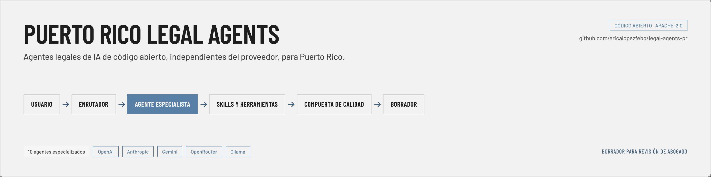
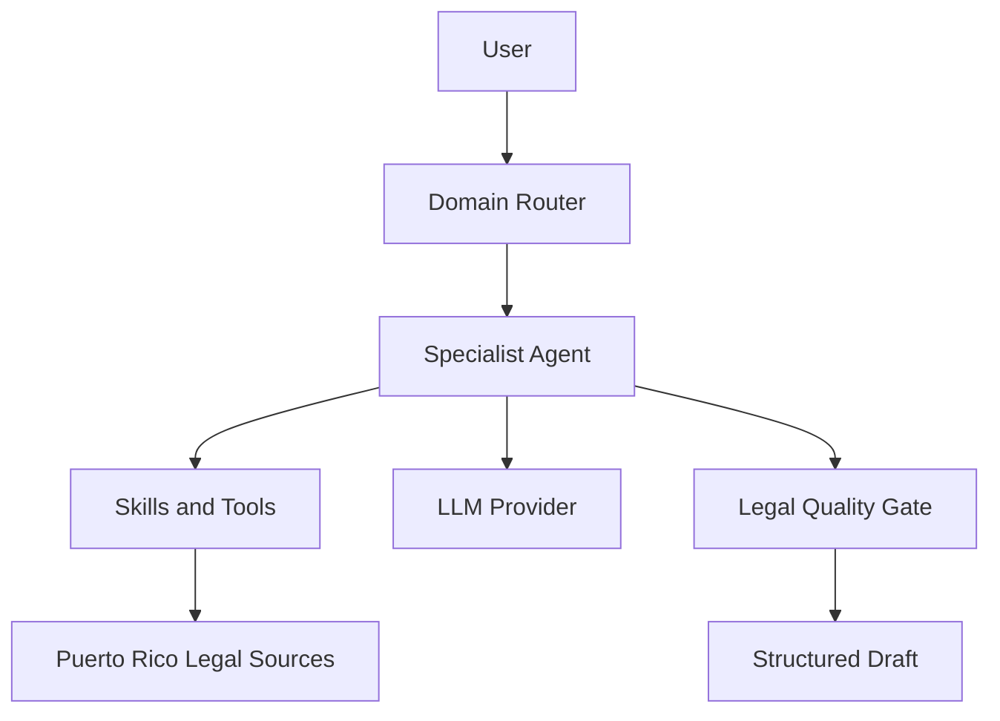

# Puerto Rico Legal Agents



[](https://github.com/ericalopezfebo/legal-agents-pr/actions/workflows/tests.yml)
[](LICENSE)

Provider-agnostic, open-source legal AI agents for Puerto Rico. The repository separates Puerto Rico legal operating instructions from the language model used to execute them.

> Every output is a draft for attorney review. The project does not provide legal advice, verify current law without a source tool, or automatically produce court-ready filings.

## What it is

- Twelve versioned specialist agents for Puerto Rico law.
- A small Python runtime with provider, tool, skill, routing, handoff and quality interfaces.
- Structured Pydantic outputs with explicit citation-verification states.
- A CLI and Python API that work offline with `MockProvider`.

## What it is not

- A legal database or source of current primary law.
- A replacement for `legal-skills-pr`, VELUM or the Puerto Rico decisions MCP.
- A hosted chatbot or a framework tied to one model vendor.
- A mechanism for marking AI work product `FINAL` without human confirmation.

## Architecture



Agent definitions live in `src/legal_agents_pr/agents/*/agent.yaml` and `system.md`. They never import provider SDKs. Optional adapters translate neutral requests for OpenAI, Anthropic, Gemini, OpenRouter and Ollama.

## Installation

```bash
git clone https://github.com/ericalopezfebo/legal-agents-pr
cd legal-agents-pr
pip install -e .
```

Install only the provider you need:

```bash
pip install -e ".[openai]"
pip install -e ".[anthropic]"
pip install -e ".[gemini]"
```

## Quickstart

Offline:

```bash
legal-agents-pr list
legal-agents-pr sources
legal-agents-pr source pr-lpau-38-2017-2025-05-16
legal-agents-pr route "¿Procede revisión judicial de la agencia?"
legal-agents-pr ask administrative-law "Identifica los asuntos generales" --output json
```

The default provider is `mock`. For a real provider:

```bash
export LEGAL_AGENTS_PROVIDER=openai
export LEGAL_AGENTS_MODEL=your-model
export OPENAI_API_KEY=...
legal-agents-pr ask administrative-law "Analiza los requisitos generales."
```

Do not commit API keys. Model names are configuration, not agent requirements.

Python API:

```python
from legal_agents_pr import LegalAgent, MockProvider

agent = LegalAgent.load("constitutional-law", provider=MockProvider())
result = agent.run("Identifica posibles controversias constitucionales.")
print(result.quality.status)
```

## Agents

- `administrative-law`
- `labor-employment-law`
- `constitutional-law`
- `notarial-law`
- `civil-law`
- `civil-procedure`
- `contracts`
- `business-organizations`
- `evidence`
- `appellate-law`
- `professional-responsibility`
- `criminal-law`

## Citation safety

`legal-agents-pr authorities` searches a citation-only candidate index by topic or citation. The
index contains candidate citation metadata only, not doctrinal content. Every result is `UNVERIFIED` and must be checked against an
official source before use. See
[docs/candidate-authority-index.md](docs/candidate-authority-index.md).

Authorities carry `VERIFIED`, `PARTIALLY_VERIFIED`, or `UNVERIFIED`. The runtime never upgrades a citation based solely on model confidence. Blogs and unknown sources cannot be represented as primary authority.

Agent source references resolve through `src/legal_agents_pr/sources/registry.yaml`. The runtime injects only version, provenance and coverage cautions into the system context; catalog membership never means that the source text or current law was verified.

Stage 2 adds a strict [source verification contract](docs/source-verification-contract.md): verified authorities require retrieval evidence, a document hash, an exact pinpoint, matching quoted text, legal-effect status and an explicit currency date. Provider-generated JSON cannot self-certify any of those facts.

## Quality lifecycle

```text
DRAFT → VALIDATED_DRAFT → ATTORNEY_REVIEW → FINAL
```

Only explicit attorney confirmation can produce `FINAL`, and unresolved blocking issues prevent it.

## Configuration

Configuration precedence is explicit arguments, environment variables, configuration file, then defaults. See [provider documentation](docs/providers.md) and `.env.example`.

## Development

```bash
pip install -e ".[dev]"
ruff check .
mypy src/legal_agents_pr
pytest
python -m build
```

## Security and privacy

Do not send confidential client material to a provider without an authorized privacy review. Tool integrations must minimize transmitted facts. See [SECURITY.md](SECURITY.md).

## License

Apache-2.0. See [LICENSE](LICENSE). Legal source data and third-party integrations may carry separate terms.

## Citation

Use the repository metadata in [CITATION.cff](CITATION.cff) when citing the software. A tagged archival release and DOI may be added later without changing the framework's legal-review safeguards.
